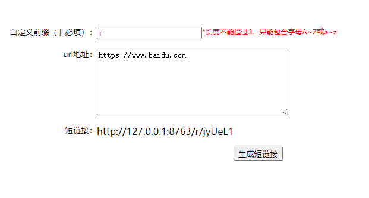
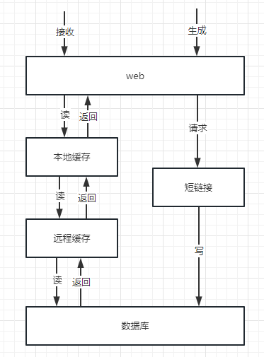

# short-link
一个由SpringBoot实现的短链接生成系统

## 启动
切换到main分支，运行**ShortLinkApplication**启动项目

访问页面：http://127.0.0.1:8763/static/view.html

**将生成的短链接拷贝到浏览器后就可以直接跳转访问**

## 分支介绍
- **main** 分支是基于纯内存实现的，因此不需要依赖第三方系统就可以直接访问
- **redis_mysql_short_link** 分支是基于**redis**和**mysql**实现的，需要可以访问到**redis**和**mysql**才可以运行

## 系统分层介绍

系统分层图

分层介绍

- **web层**用于接收前端接口请求并生成短链接或者执行短链接跳转
- 对于生成短链接请求主要职责是调用**短链接**模块将原始链接生成短链接数据，并且将数据写入到数据库中存储
- 对于短链接的接收请求主要职责是获取短链接对应的原始链接，并执行目标链接的跳转
  - 首先在**本地缓存**中获取数据
  - **本地缓存**无数据则从**远程缓存**获取数据
  - **远程缓存**无数据则从**数据库**中读取数据
  - 从**数据库**中读取数据后再将数据写回**本地缓存**和**远程缓存**
  
> main分支是基于纯内存实现；对于使用redis作为远程缓存和mysql作为数据库存储可以切换到分支：redis_mysql_short_link

## 配置参数介绍

| 字段          | 默认值      | 描述                     |
|-------------|----------|------------------------|
| short.link.localCacheMaxSize | 1000     | 本地缓存项的最大数目             |
| short.link.localCacheExpire | 600000 | 本地缓存项的过期时间，10分钟        |
| short.link.domain | http://127.0.0.1:8763 | 解析短链接的域名，也就是项目访问的域名 |